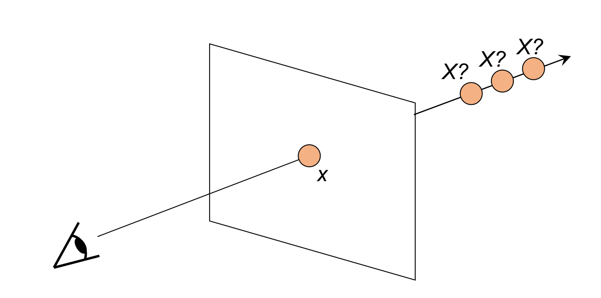
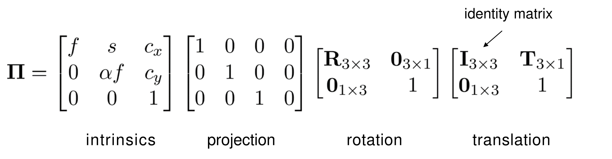
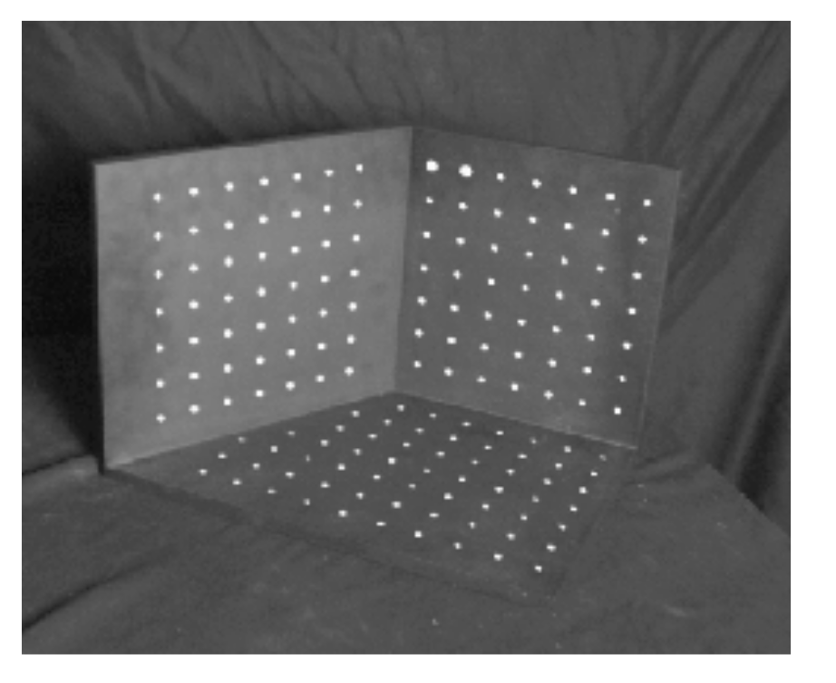
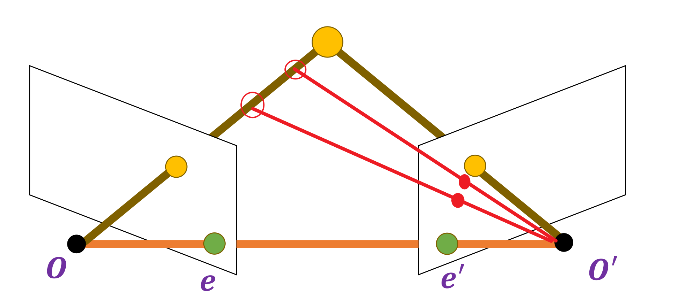
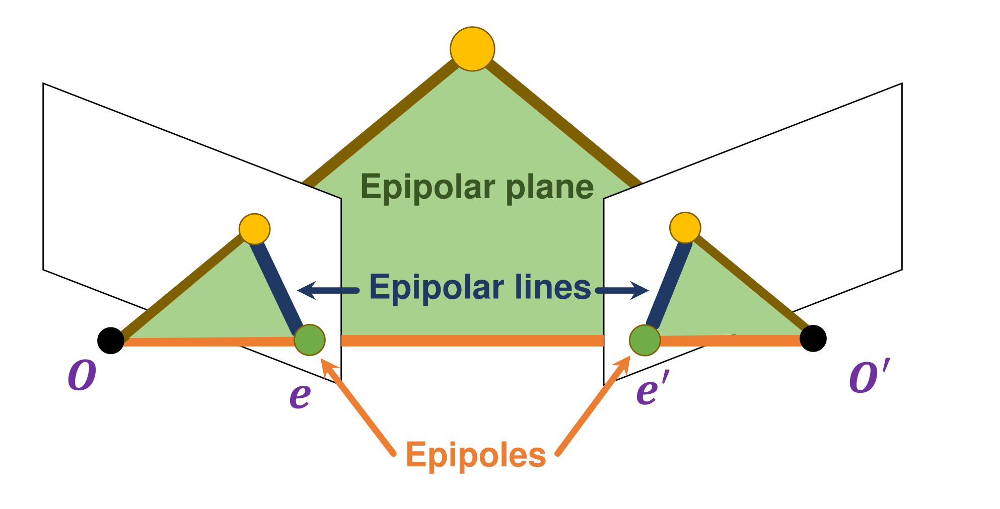

---
head:
  - - link
    - rel: stylesheet
      href: https://cdnjs.cloudflare.com/ajax/libs/KaTeX/0.5.1/katex.min.css
---
# 三维重建

我们之前介绍了摄像过程世界物体到相片像素的映射关系，这实际上也是从三维世界构建二维照片的过程，一个自然的想法是，我们能从三维世界得到二维的照片，那是不是也可以从二维的照片重建出三维世界的信息？这篇笔记将介绍三维重建的相关内容。

## 什么是三维重建

简单来说就是我们从二维的照片中重建出三维的信息的过程。具体是什么信息呢？最一般地，我们如果能重建出相片上每一个像素对应世界物体在世界坐标系的坐标，就可以认为重建出了三维的信息了。关于世界坐标系，如果你不清楚，可以看我之前的笔记[摄像过程中的坐标变换](./camera-coordinate.md)。

## 我们需要什么

在上面的笔记中，我们讲述了从世界物体到一张照片的过程，我们今天的工作其实就是一个相反的过程。我们得到的输入是二维的照片，然后进行三维重建。那么，如果我们有相机的内参矩阵、外参矩阵和一张照片，是不是就可以恢复出三维的信息了呢？答案是否定的。这其实涉及到照片的歧义问题。我们来简单说明这个问题，为了说明的方便，我们注意到图像坐标系到像素坐标系的映射是不依赖于拍摄场景等的，在三维重建的时候可以先将照片上得到的像素坐标信息变为图像坐标信息，又注意到成像过程实际上是一个相似变换，我们图像平面等价成相机前方的一个平面，并绕光轴旋转 $180$ 度，也就是如下的示例图：

好吧，这张图实际上包含了更多的信息，因为这是在课件上截取下来的，我懒得自己去画。图中的那个平面就是我们上面等价成的那个平面，实际上实现了图像坐标系的坐标轴与相机坐标系的对齐，从而我们将成像过程简化成了一个透视投影的过程，物体与眼睛（或相机）的连线与平面的交点即为其像的位置。从图片中我们很容易可以理解歧义问题，显然图片中直线上每一个点都是成像在相同的位置，我们如果只有一张照片和相机的相关参数，我们并不能确定一个像素对应的是直线上的哪一个点。

通过上面的分析，我们就说明了照片的歧义问题，同时我们建立了从透射投影理解成像过程的视角，我们接下去的分析也都是基于此。实际上我们的分析也展示了歧义问题其实就是深度的歧义，我们无法确定像素对应的物体相对于相机平面距离，如果在之前的那篇笔记，也就是物体在相机坐标系下的 $z$ 轴坐标，我们重建三维就必须找到一个求解物体 $z$ 轴坐标的方法。

一张照片不行，那多几张是不是就可以了？是的，实际上我们只需要两张照片（显然是不同的两张）加上两张照片对应的相机的参数（内参矩阵和外参矩阵），就可以完成三维重建了。具体的来说，我们对于两张照片上相互匹配的像素点（也就是描述的是同一个世界物体的像素点），以物体在世界坐标系的坐标为未知量，通过相机参数求出像素坐标，令其等于我们在照片上得到的像素坐标，列出方程组并求解。我们需要求解的是三个未知量（三个坐标分量），共有四个方程（每张照片根据像素坐标的两个分量列出两个方程），这是可解的问题。

当然，这可以用更形象的方式进行说明。在我们上面的图中注意到，尽管我们不能准确的知道世界坐标中的坐标，但我们可以确定这个点在一条直线上，那么如果我们有两张图片，就可以确定两条直线，从而两条直线的交点就是世界物体。

## 相机标定

根据上面的分析，我们需要两张照片，以及两张照片对应的相机外参和内参，和像素点的对应关系。这里我们来讨论相机外参和内参的获取问题，也就是**相机标定**。

> 相机标定是指通过一系列的图像和已知的参考点，确定相机的内外参数的过程。

“一系列图像和已知的参考点”是指什么呢？其实就是一系列物体在世界坐标系的坐标和成像后在像素坐标系的坐标。所谓的相机标定就是指根据已知的相互对应的三维坐标和二维坐标得到相机的一些参数的过程。

### 我们要求解什么

在展开之前，我们需要重新回顾一下之前的[这篇笔记](./camera-coordinate.md)。在[这篇笔记](./camera-coordinate.md)的后面，我们得到了一个成像公式：

$$
\left[
  \begin{matrix}
  x' \\
  y' \\
  1
  \end{matrix}
\right] = \frac{1}{z} \left[
  \begin{matrix}
  \frac{f}{dx} & 0 & c_x \\
  0 & \frac{f}{dy} & c_y \\
  0 & 0 & 1
  \end{matrix}
\right] \left[
  \begin{matrix}
  1 & 0 & 0 & 0 \\
  0 & 1 & 0 & 0 \\
  0 & 0 & 1 & 0
  \end{matrix}
\right] \left[
  \begin{matrix}
  R & 0 \\
  0 & 1
  \end{matrix}
\right] \left[
  \begin{matrix}
  I & T \\
  0 & 1
  \end{matrix}
\right] \left[
  \begin{matrix}
  x \\
  y \\
  z \\
  1
  \end{matrix}
\right]
$$

我们单独考虑的变换矩阵，得到这样的矩阵：

$$
\Pi = \frac{1}{z} \left[
  \begin{matrix}
  \frac{f}{dx} & 0 & c_x \\
  0 & \frac{f}{dy} & c_y \\
  0 & 0 & 1
  \end{matrix}
\right] \left[
  \begin{matrix}
  1 & 0 & 0 & 0 \\
  0 & 1 & 0 & 0 \\
  0 & 0 & 1 & 0
  \end{matrix}
\right] \left[
  \begin{matrix}
  R & 0 \\
  0 & 1
  \end{matrix}
\right] \left[
  \begin{matrix}
  I & T \\
  0 & 1
  \end{matrix}
\right]
$$

但实际上变换矩阵是更复杂的，这里给出通常的形式：

这张图片也是直接从课件中截取的，我们注意到的变化比较多。首先少了 $\frac{1}{z}$ 项，这是因为课件得到的是齐次坐标，我们多的这一项实际上是从齐次坐标得到真实坐标数值需要除以的项。我们还注意到第一个矩阵的对角线前两个数也变了，这实际上是因为课件将成像过程的缩放系数和从图像坐标系到照片的像素坐标系的缩放系数进行了统一，也就是令 $f = \frac{f}{dx}$ ，而所谓的 $\alpha$ 其实就是 $\frac{dy}{dx}$ ，这个系数只有在像素不是正方形的时候不为 $1$ 。最后我们还注意到第一个矩阵多了一个数 $s$ ，这个是干什么的呢？这个系数主要是为了表示当像素为平行四边形的时候的变换矩阵，一般情况下像素为矩形，这是其值就为 $0$ 。

下面我们就基于课件中的这个变换矩阵来进行相机标定，在这之前我们再进行一下简单的变换。我们将第一个矩阵即为 $K$ ，将后面三个矩阵合并为 $\left[ R\  t\right]$ ，前者为相机的内参矩阵，后者为相机的外参矩阵。也就是说，成像过程被我们写成了

$$
x \cong K\left[R\ t\right]X
$$

其中 $x$ 表示的是像素坐标， $X$ 表示的是世界坐标，并且都是齐次坐标。而符号 $\cong$ 则表示这是基于齐次坐标的相等，也就是等号两边作为齐次坐标表示的是同一个二维坐标，而数值上还差了一个系数。需要注意的是，合并后我们的 $t$ 实际上等于原来的 $RT$ ，但这里我们为了与课件和很多资料保持一致，也记作这个记号，尽管这有很强的误导性。而我们的相机标定，就是要求解 $K$ ， $R$ 和 $t$ 。

### 参考点如何获取

这是一个很无聊的问题，但为了完整性，我们还是简单说一下。一个最简单的方法就是我们在场景中有三块板子，上面有一些点，摆在一定的位置，那么这些点的世界坐标就是已知的，而像素坐标在照片上就可以读取。比如课件上的这张示意图：

事实上理论推导并不需要说明这个，但感觉不说，换作是我也会在这里疑惑，所以简单说一下。总之，你只需要知道确实有这样的一系列参考点，它们的世界坐标和像素坐标都是已知的，现在我们需要的只是根据这些坐标求解相机的参数。

### 如何求解

我们分为两步进行求解。

#### 求解变换矩阵

首先我们先求解变换矩阵，也就是 $P = K\left[R\ t\right]X$ 。

正如我们上面所说的， $x$ 与 $PX$ 仅相差了一个系数，所以他们的叉乘结果为零向量（并不是很容易想到，但经常要用到，记住就好）。也就是

$$
x \times PX = 0
$$

而向量的叉乘可以写作矩阵乘法的形式（参考这篇[知乎文章](https://zhuanlan.zhihu.com/p/589932081)）。所以这实际上是一个矩阵方程，整理出来也就是关于 $P$ 的每一个元素的一个线性方程组。 $P$ 是一个 $3\times 4$ 的矩阵，我们将其写作一个 $12$ 维的列向量，那么每一个参考点得到的是 $2$ 个方程（因为我们得到的表示向量叉乘的矩阵是一个秩为 $2$ 的矩阵，而我们最终根据叉乘结果每个分量为 $0$ 列出的三个方程的系数矩阵秩也为 $2$ ，高斯消元后就是 $2$ 个矩阵）。假设我们有 $n$ 个对应的参考点，我们就得到了一个这样的线性方程组：

$$
A_{2n\times 12}P_{12} = O_{2n}
$$

我们的任务就是求解这个方程。由我们的数据总是存在误差，我们得到的矩阵 $A$ 大概率秩是等于 $9$ 的，也就是说我们得到的解很可能只有零解，这显然不是我们需要的解。如何理解这个问题呢？我们需要重新理解我们得到的方程。我们希望得到的解是什么呢？注意到我们使用的齐次坐标，所以如果 $P_1$ 是我们的解，那么 $kP_1$ 也应该是我们的解。我们还希望解是唯一的，这里的唯一指的应该是如果 $P_1, P_2$ 都是解，那么必须有 $P_1 = kP_2$ 。写到这里可能也看出来了，我们需要的解是一个一维的线性空间的。这也就要求，矩阵 $A$ 应该是一个秩为 $8$ 的矩阵，但我们的数据有误差，所以得到的矩阵大概率是满秩矩阵，也就是秩为 $9$ ，这也就是为什么我们无法得到我们实际需要的解。

为了解决这个问题，我们重新审视我们得到的方程，考虑 $A$ 矩阵行向量张成的线性空间，我们所要求的解其实就是这个空间的正交补空间中的一个向量，而在这个问题中我们所希望的正交补空间是一个一维的线性空间。考虑到实际的行空间实际上张满了整个空间，所以我们需要先求对 $A$ 的行向量进行主成分分析，找到一个 $8$ 维子空间，使得 $A$ 的行向量到子空间的距离的平方和最小，从而用这个子空间近似原来的行空间，而我们的解空间就可以定义为这个子空间的正交补。注意到 $A^TA$ 的行空间也是 $A$ 的行空间，我们只需要求 $A^TA$ 的主成分，这是一个对称矩阵，可以用正交对角化，那么其最大的 $8$ 个特征值对应的特征向量就是所求的 $8$ 维子空间的一组基，而最小的特征值对应的特征向量张成的特征向量就是这个子空间的正交补。

经过我们的分析，我们实际上需要求的是 $A^TA$ 的最小特征值对应的特征向量。这个是比较简单的。

最后的问题就是，我们得到的实际上是整个解空间，实际上我们只需要一个解，一般地我们将其正规化，也就是使其模长为 $1$ 。

#### 从变换矩阵分解出 $K$ ， $R$ 和 $t$

上面我们求解出了变换矩阵（只需要对解的形状变换一下），也就是我们知道了 $K\left[R\ t\right]$ ，那么如何求得 $K$, $R$ 和 $t$ 呢？首先将变换矩阵写为分块矩阵，也就是 $\left[KR\ Kt\right]$ ，也就是矩阵的前三列构成的矩阵（设为 $P1$ ）等于 $KR$ ，最后一列即为 $P_2$ 等于 $Kt$ 。注意到 $K$ 是一个上三角矩阵，而 $R$ 是旋转变换的矩阵，也就是一个正交矩阵，我们自然而然的联想到了 $QR$ 分解。关于 $QR$ 分解，可以看这篇[知乎文章](https://zhuanlan.zhihu.com/p/362248020)，简单的理解角度可以是对列向量进行施密特正交化和单位化，按列排布其系数为正线上三角矩阵 $R$ ，其正交单位化向量按列排布为正交矩阵 $Q$ 。但我们这里需要的是第一个矩阵是正线上三角矩阵，第二个矩阵为正交矩阵。一个简单的理解方式就是考虑矩阵 $P_1^T$ 的 $QR$ 分解，然后再取转置，但这样我们得到的第二个矩阵是一个正线上三角矩阵，转置之后得到的是正线下三角矩阵，需要作出进一步的调整，具体来说就是需要 $P_1^T$ 分解得到的第二个矩阵是一个正线下三角矩阵。注意到 $QR$ 分解中的正线上三角矩阵实际上是系数的排列，所以一个自然的方法（好吧，其实并不自然）就是我们调整施密特正交化的顺序，从最后一个列向量（在原矩阵就是最后一个行向量）开始往前进行施密特正交化，再进行单位化。具体的就是我们将 $P_1^T$ 分解为 $QL$ ，然后有 $P_1 = L^TQ^T$ ，从而 $K=L^T, R=Q^T$ 。注意最后的 $R$ 指的是旋转矩阵，而不是前面 $QR$ 分解的 $R$ 。得到 $K$ 和 $R$ 之后，我们很容易根据 $Kt=P_2$ 求出 $t=K^{-1}P_2$ ，从而我们就完成了 $K$, $R$ 和 $t$ 的求解，也就完成了相机标定。

### 其他求解方法

上面我们给出了通过主成分分析和特征分解求解变换矩阵和通过 $QR$ 分解求解 $K$, $R$ 和 $t$ 的方法，但实际上变换矩阵的求解还有其他的方法。

我们重新审视变换矩阵的求解，可以证明我们原来的求解过程数学等价于求一个模长为 $1$ 的向量使得 $Ap$ 的模长最小，也就是最小二乘法。这里我们可以将 $Ap$ 的模长理解为误差，当方程存在解的时候 $Ap=0$ ，误差为 $0$ 。也就是我们的求解思路可以是最小化某一个误差。上面我们用到的误差实际意义是有限的，并不能很好地反映真实的变换矩阵的效果，我们考虑其他的误差方式。考虑误差的实际意义，我们可以定义为变换矩阵作用于三维坐标后的得到的像素坐标的估计与真实像素坐标的误差，这个误差可以用估计的像素坐标和真实的像素坐标的距离来度量。在[这篇文章](https://bbs.huaweicloud.com/blogs/411042)我还看到一种在二维坐标进行标定的方法，但没有看到详细的解释，我也没有想到很好的方法进行这种标定方式，这里就不写了。

这一部分的内容主要参考了[计算机视觉算法中的 相机标定（Camera Calibration）](https://bbs.huaweicloud.com/blogs/411042)。

## 对极几何

获取了相机的参数之后，我们要想完成三维重建，还需要获取两张照片中的对应点，也就是我们需要找出那些点描述的是同一个物体。一个朴素的方法是，我们在两张照片中分别提取特征点，然后进行特征点匹配。这个方法必然是可行的，但是效率不高。

为什么效率不高？我们考虑一张照片上的一个特征点，由于我们已经进行了相机标定，也就是知道了相机的参数，事实上根据我们上面的分析，我们知道这个点对应的世界物体必然在一条直线上，也就是相机与这个点对应图像坐标系的点的连线，如图

那么这个点对应的世界物体在第二张照片上对应的点也只可能在某个范围内，而不会是整张照片都可能，而我们在进行特征点匹配的时候并没有利用这个信息，只是对所有的特征点逐一进行匹配。

也就是说，两张照片上的对应点事实上存在某种约束关系，只有符合这一约束关系的两个点才可能是匹配的，而朴素的特征点匹配效率不高的原因就在于我们没有考虑这一约束关系。了解了这个，我们自然就会像研究这一约束关系，而这就是对极几何的问题了。

### 什么是对极几何

先直接引用[维基百科](https://zh.wikipedia.org/zh-cn/%E5%AF%B9%E6%9E%81%E5%87%A0%E4%BD%95)的定义：

> 对极几何是立体视觉中的一种几何关系。当两个摄像机从两个不同的位置观察3D场景时，3D点及其在2D图像上的投影之间存在许多几何关系，从而导致图像点之间的约束。这些关系是基于针孔相机模型的假设推导出来的。

简单理解就是两个摄像机从不同位置和角度拍摄同一场景的时候，得到的照片上对应的点存在的约束关系，而这种约束关系的推导是基于针孔相机模型的。（好吧，好像跟定义没有什么区别）

### 极点、极线与极面

回到这张图，

我们再添加一个视角，变成如下的图（修改自课件的图片）：

很容易发现，第二个相机与第一个相机和第一张照片对应的图像坐标系的点的连线构成了一个平面，注意到第一张照片上的特征点对应的世界物体必然在连线上，而第二张照片上对应的点在图像坐标系的点正是世界物体与第二个相机的连线与第二个相机的图像平面的交点，又注意到第二个相机与第一个相机和第一张照片对应的图像坐标系的点的连线上的每一个点的连线显然都在上面的得到的平面上，所以第二张照片对应的点在图像坐标系上的点也必然在该平面上，从而第二张照片上对应的点一定分布在上面得到的平面与图像平面的交线上。

事实上，如果取定一个世界物体，对于两个相机与世界物体构成的平面，我们称为**极面**，这个所谓的极面事实上与我们上面第二个相机与第一个相机和第一张照片对应的图像坐标系的点的连线构成了一个平面是同一个平面。而极面与两个图像平面的两条交线，我们定义为**极线**，这事实上就是世界物体在一个图像平面的点对应的另一个图像平面所有可能点的集合。注意到所有的记面都过两个相机所在的点，也就是都过两个相机的连线，所以极面与图像平面的交线必然过相机连线与图像平面的交点，我们将相机连线与两个图像平面的交点记为**极点**。如下图（来自课件的截图）所示：

### 如何求解极线

回到我们开始的问题，我们实际上需要根据一张照片上的一个点，求得另一张照片上的可能的对应的点的分布。注意到照片上的点与图像坐标系的点的对应关系是一一对应且很好求解的（因为我们已经知道了相机的参数），我们先考虑一个相机的图像平面上的点对应另一个相机的图像平面所有可能点的几何，也就是要求解极线。

如何求解极线？最朴素的想法就是，既然极线是极面与图像平面的交点，那么我们直接把这两个平面求出来不久能解出极线了吗？（好吧，我觉得应该不会有人这么想）很显然，这个方法很难实现。

我们重新考虑这个问题，我们所说的求解极线，并不是真的要把它在世界坐标系下的方程求出来，而是要把它在图像坐标系下的方程求解出来。设 $(x_2, y_2)$ 是 $(x_1, y_1)$ 对应的极线上一个点，其中 $(x_1, y_1)$ 在第一个图像平面上， $(x_2, y_2)$ 在第二个图像平面上，我们重新建立一个世界坐标系，将其定义为第一个相机的相机坐标系，设两个图像平面上的两个点对应的世界物体在这个世界坐标系下的坐标为 $(X, Y, Z)$ 。这里我们做了一个坐标系变换，根据坐标系变换的知识，我们很容易的得到新的世界坐标系到两个相机坐标系的变换矩阵，根据[上一篇笔记](./camera-coordinate.md)的内容我们就可以得到 $(X, Y, Z)$ 与 $(x_1, y_1)$ 和 $(x_2, y_2)$ 之间的变换关系。

具体如何得到呢？这里我们简单推导一下。事实上在相机标定的时候我们已经得到了两个相机的参数 $K, R, t$ ，我们分别社为 $K_1,$

这一部分的内容主要参考了[计算机视觉系列教程14：对极几何基本原理图解](https://zhuanlan.zhihu.com/p/399190891)。
