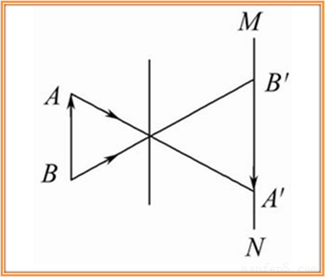

---
head:
  - - link
    - rel: stylesheet
      href: https://cdnjs.cloudflare.com/ajax/libs/KaTeX/0.5.1/katex.min.css
---
# 摄像过程中的坐标变换

这篇笔记将讲述摄像过程中的坐标变换问题，这是计算机视觉中一个比较难的知识点，希望我的这篇笔记能对读者带来帮助。我之所以会写这篇笔记，很大的一个原因也是我被这个问题困扰了很久，也困扰了多次，也就是搞懂了（看似搞懂了）一次，又忘记一次。

## 成像过程

首先我们从中学的物理知识出发，大体了解一下摄像机拍摄的时候物体成像的过程。这里我们需要明确一点，我们使用的是小孔摄像机，原理是小孔成像。很显然，现实中我们大概率不会使用小孔摄像机，而应该是凸透镜成像的摄像机，但是，网上能找到的所有推导成像过程的坐标变换的文章使用的其实都是小孔摄像机。但现在还有个问题，就是网络上大部分的推导中会用到所谓的焦距，但事实上小孔成像并没有焦距的概念，而这些推导所说的 $f$ 其实是**像距**，也就是光屏到小孔的距离。当然，大部分网上的推导都会将小孔成像推导出的结论推广到凸透镜成像上，但是推广后我们用到的 $f$ 其实**还是像距**，而不是焦距，这一点困惑了我很久，如果搞不懂这一点，那么我们稍微一推导就会发现这种推广是错误的。

> 至于为什么大家总是喜欢使用 $f$ 甚至是使用焦距来描述像距，这我也不清楚。

重新回到成像过程，我们已经明确了我们使用的成像手段，也就是小孔成像，下面我们来分析一下光路。图片来自百度图片，如有侵权请联系删除。

我们记小孔为 $O$ ，记 $O$ 到 光屏 $MN$ 的距离为 $f$ ，也就是**像距**，设物距为 $s$ ，很显然成像是有缩放的，根据相似三角形，我们可以推出

$$
\frac{\overline{A'B'}}{\overline{AB}} = \frac{f}{s}
$$

当然，我们还观察到物体和像是倒立的关系，但这在我们处理图像的时候是没有影响的，因为我们拿到的图片已经帮我们倒过来了。

简单总结一下，小孔成像也就是将物体成像到光屏上，同时会有大小的缩放。

## 坐标系的引入

### 引入坐标系

首先，我们需要建立坐标系来描述物体的位置。我们建立**世界坐标系**，这是一个三维坐标系。世界坐标系没有固定的要求，你可以在空间中任意取一点作为原点，然后取任意三个相互垂直、构成右手系（其实右手系也不是严格要求的）的方向建立坐标系。

考虑到世界坐标系可能建立在任何地方，坐标轴也可能在各个方向，而我们的成像实际需要的是物体相对于光心、主光轴和光屏等的相对位置。为此，我们再建立一个**相机坐标系**。我们取光心（小孔）为坐标原点，取主光轴朝向物体方向为 $z$ 轴方向，背对光屏向右为 $y$ 轴方向，向下为 $x$ 轴方向。这样的话，物距就可以用 $z$ 轴的坐标来描述了。

考虑到像其实只分布在光屏一个平面上，我们完全可以在光屏上再建立一个二维的**图像坐标系**，这不仅方便了像的表示，也方便了从像到图片的映射。一般情况下，我们将坐标原点选取为主光轴与光屏的交点，以从小孔面向光屏时左方向为 $y$ 轴方向，向上为 $x$ 轴方向。考虑到像是倒立的，图像坐标系的坐标轴方向其实就是与像素坐标系的坐标轴方向一致的。

除了研究成像的过程，我们还需要研究像与照片的关系，这两者不是同一个概念。图像通过小孔在光屏上成像之后，感光器会记录光屏上的光信息，也就是像的信息，写为照片。照片由像素构成，一个相片中，每一个像素都有自己的像素坐标，这通常都是以相片左上角的为像素为原点，向右为 $y$ 轴正方向，向左为 $x$ 轴正方向，一个像素为单位长度建立的坐标系下的坐标，这个坐标系称为**像素坐标系**。

通过以上的分析，我们自然地引入了四个坐标系，**世界坐标系、相机坐标系、图像坐标系和像素坐标系**。

### 坐标系之间的关系

概括地说，世界坐标系和相机坐标系都是三维的坐标系，用来描述物体的位置；图像坐标系和像素坐标系都是建立在成像平面上的二维的坐标系，描述像的位置信息。

需要注意的是，像和照片不是同一个概念。简单地理解，像是小孔将外界物体发出的光线过滤后在光屏上形成的，而感光器接受光线后记录光线信息，将这些信息写入照片中。照片上一个像素对应像的某一部分，而像的这一部分对应到物体的某一部分。图像坐标系描述的是像上不同点的位置信息，像素坐标系描述的是像素的位置信息，不再是物体或像的信息。

还需注意的是，世界坐标系和相机坐标系也有很大的不同。在一些计算机视觉问题中，比如三维重建，相机位置和方向都是会改变的，也就是拍摄不同照片的时候相机坐标系也是有多个的，但为了描述的统一，世界坐标系只能有一个。同时，世界坐标系和相机坐标系地位也是不同的。这涉及到坐标变换和坐标系变换的问题。这部分具体的内容可以参考这篇[知乎文章](https://zhuanlan.zhihu.com/p/661060377)。

:::tip
需要注意的是，这篇[知乎文章](https://zhuanlan.zhihu.com/p/661060377)描述的坐标系变换实际上只有坐标系的原点不变的类型。
:::

简单概括文章中关于世界坐标系的作用的内容就是，我们先定义了世界坐标系，随后我们定义其他坐标系的时候，其他坐标系的三个坐标轴的方向向量可以用它们在世界坐标系下的坐标来描述，这些坐标排列在一起构成一个矩阵，从而我们用这个矩阵来描述坐标系，进而我们可以方便地定义坐标、坐标系变换等，同时也统一了坐标变换和坐标系变换。

:::warning
你应该阅读完上面的那篇[知乎文章](https://zhuanlan.zhihu.com/p/661060377)，了解了坐标变换和坐标系变换的问题之后，再继续阅读这篇笔记。
:::

## 几个坐标系之间的变换

我们建立了以上四个坐标系后，我们来考察从物体到照片上一个像素的过程。

首先，我们拿到的是物体在一个世界坐标系下的坐标信息，但在成像过程中，我们需要的是物体与光心、主光轴等的相对位置信息，也就是我们应该**得到物体在相机坐标系下的坐标信息**。如何得到这个坐标呢？两个坐标系都是右手系，所以从世界坐标系到相机坐标系的坐标系变换其实是一个刚体变换，可以用平移变换和旋转变换复合得到。根据[知乎文章](https://zhuanlan.zhihu.com/p/661060377)里面的内容，坐标变换和坐标系变换是相反的，我们将坐标系变换的逆变换作用到世界坐标系下的坐标，就可以得到物体在相机坐标系上的坐标。而我们知道，平移变换的逆变换还是平移变换，旋转变换的逆变换也还是旋转变换。所以，从世界坐标系下的坐标变为相机坐标系下的坐标，**只需要对坐标作用一个平移变换和一个旋转变换**，也就是加上一个向量，然后乘一个正交矩阵。

:::note
事实上这对于很多刚接触这个问题的人来说是并不显然的，需要理解了坐标变换和坐标系变换的关系才能理解，很多文章没有介绍这一部分知识就指出可以用平移变换和旋转变换来实现坐标的变换，这其实并不严谨，很容易让人在理解上感到困惑。
:::

我们得到了物体在相机坐标系中的位置信息后，就可以方便地推导成像的过程了。不同于上面从世界坐标系到相机坐标系的转换，我们这里从相机坐标系到图像坐标系的转换实际上是物体也发生了变化，**研究的并不是同一个物体在不同坐标系下的坐标，而是物体和其在光屏上成的像在各自的坐标系下的坐标**。画一下图就可以发现在 $x$, $y$ 轴上的坐标变换是一个简单的缩放关系，缩放比例正好是 $\frac{f}{z}$， 其中 $z$ 是物体在相机坐标系下的 $z$ 坐标（这里需要注意，**$f$ 表示的是像距，不是通常情况下表示的焦距**）。图像坐标系是一个二维坐标系，并没有 $z$ 坐标，于是我们推导出了图像坐标系上像的坐标。反映到坐标数值上的变换，这其实需要对我们在相机坐标系上得到的坐标**作用一个投影变换**（就是左乘矩阵 $\left[
  \begin{matrix}
  1 & 0 & 0 \\
  0 & 1 & 0
  \end{matrix}
\right]$用以消去 $z$ 坐标），**再作用一个缩放变换**（乘以矩阵 $\left[
  \begin{matrix}
  \frac{f}{z} & 0 \\
  0 & \frac{f}{z}
  \end{matrix}
\right]$）。

随后我们需要将图像坐标系上像的坐标对应到像素坐标系上。我们之前提到了这两个坐标系一个描述的是像的位置信息，一个描述的是记录了像的信息的照片上像素的位置信息，一个像素和像上一个区域对应，这样的区域大小是固定的。考虑到像素坐标系原点对应的像上的区域与图像坐标系的原点并不重合（一般情况下，图像坐标系的坐标原点，也就是主光轴与光屏的交点都是在感光区域的中心，对应的是相片中心的像素，不过有些时候不是这样），我们应该先将考虑一个中间坐标系，这个坐标系坐标轴方向与图像坐标系的一致，但坐标原点取在像素坐标系原点对应的区域的右下角，其实也就是感光区域的右下角。这个中间坐标系实际上是从图像坐标系平移得到的，要得到像上一点在这个中间坐标系的坐标，只需要**对这个点在图像坐标系上的坐标进行平移变换**即可。而从这个中间坐标系映射到像素坐标系则是很简单的，考虑一个像素在 $x$ 轴对应实际的长度为 $dx$ ，**只需将中间坐标系下的坐标除以 $dx$ 即可得到该点在照片上对应的像素的 $x$ 轴坐标， $y$ 轴类似**。这在数值上是一个缩放变换，不过同时改变了单位。

最后总结一下数值上我们如何从世界坐标系的坐标的到像素坐标系的坐标，**首先是做一个平移变换和旋转变换到相机坐标系上的坐标，再作一个缩放变换到图像坐标系上的坐标，最后作一个平移变换和缩放变换到像素坐标系上的坐标**。

:::tip
需要注意的是，这个过程并不是对这个物体进行这些变换，这些变换仅仅是我们推导出来的需要对坐标数值进行的操作，实际的过程如我们上面分析的那样。
:::

## 实际的计算过程

通过上面的分析，我们已经小孔成像的相机的成像过程有了较好的了解，也了解了从世界坐标系到像素坐标系的坐标是如何映射的，其实你已经可以完成从世界坐标系到像素坐标系的坐标映射的计算了。当然，实际的计算过程并不是像我们上面的分析一样一步步的进行，下面我们来介绍一下实际的计算过程。

### 引入齐次坐标

我们注意到，我们上面提到的变换中，大部分都可以用矩阵乘法表示，但平移变换并不能，为了能统一变换的表示（好吧，我承认这个作为引入齐次坐标的理由并不充分，但我也找不出更好的理由了），我们引入齐次坐标。

关于齐次坐标，大家可以看一下这篇[知乎文章](https://zhuanlan.zhihu.com/p/110503121)。

:::warning
你应该阅读完上面的那篇[知乎文章](https://zhuanlan.zhihu.com/p/110503121)，了解了齐次坐标的基本知识，再继续阅读本篇笔记。
:::

齐次坐标，其实就是用一个 $n+1$ 维的向量表示 $n$ 维空间中的一个点，一个 $n$ 维空间的一个点 $A$，将其坐标拼接一个 $1$ ，得到一个 $n+1$ 维空间的一个点的坐标，过这个 $n+1$ 维的点与原点的直线上每一个点（不考虑原点）都表示 $n$ 维空间的 $A$ 点。特别的，当 $n+1$ 维空间的点最后一个维度坐标为 $0$ 的时候，对应的是 $n$ 维空间的无穷远点。如果要从一个齐次坐标得到一个点在 $n$ 维空间的坐标，只需要将齐次坐标除以最后一个维度的坐标，将最后一个维度化为 $1$ ，前面 $n$ 个维度的坐标就是该点在 $n$ 空间中的坐标。

引入了齐次坐标之后，我们重新考虑之前的变换过程。首先我们将世界坐标系下的坐标后面拼接一个 $1$ ，得到齐次坐标。我们来考虑从世界坐标系到相机坐标系的平移变换和旋转变换，关于齐次坐标表示的时候如何表示平移变换和旋转变换，可以参考这篇[知乎回答](https://www.zhihu.com/question/36296104/answer/83199096)，说得很详细。（我确实很喜欢直接引用别人的文章和回答，一方面我写得不如这些文章和回答，直接引用可以提高我的文章的质量，另一方面也是因为我比较懒（手动狗头））

经过平移变换和旋转变换后，我们得到的还是一个齐次坐标，而且最后一个维度坐标为 $1$ 。

随后我们来考虑从相机坐标系到图像坐标系的坐标映射，这个过程需要对坐标向量进行投影变换和缩放变换，在齐次坐标下如何定义呢？一个自然而然的想法就是，考虑到我们得到的齐次坐标最后一个维度还是 $1$ ，所以其次坐标前三个维度的坐标还是真实物体在相机坐标系下的坐标，所以我们只需要在投影变换的时候同时消去引入最后一个维度和 $z$ 轴坐标，然后缩放变换与之前的讨论一致。这当然是可行的，但其实还有更好的做法。

考虑到我们得到图像坐标系下的坐标后，还需要进行平移变换，所以我们最好能在上一步的变换中得到的是齐次坐标，这样我们就不需要重新将二维坐标变为齐次坐标。如何实现这一点呢？我们尝试在投影变换的时候只消去最后一个维度，那么我们得到的就是 $\left[
  \begin{matrix}
  x \\
  y \\
  z
  \end{matrix}
\right]$ ，这是投影矩阵就是 $\left[
  \begin{matrix}
  1 & 0 & 0 & 0 \\
  0 & 1 & 0 & 0 \\
  0 & 0 & 1 & 0
  \end{matrix}
  \right]$ 我们注意到从相机坐标系到图像坐标系的映射中， $x$ 坐标和 $y$ 坐标都只是乘了同样比例的系数，这也可以理解为先乘以 $f$ ，在除以 $z$ ，看到除以 $z$ 这一步，我们不难注意到这个过程和从齐次坐标得到原坐标的时候除以最后一个维度的坐标是很相似的，我们自然而然地联想到（好吧，其实这一点都不自然），可以先得到一个三维向量来表示像在图像坐标系的坐标，其中最后一个维度为 $z$ ，这样的齐次坐标将是 $\left[
    \begin{matrix}
    fx \\
    fy \\
    z
    \end{matrix}
  \right]$ ，要得到这样的坐标，只需要对上面投影变换得到的坐标的 $x$ ， $y$ 坐标进行缩放，乘以 $f$ 即可，也就是乘以缩放矩阵 $\left[
    \begin{matrix}
    f & 0 & 0 \\
    0 & f & 0 \\
    0 & 0 & 1
    \end{matrix}
  \right]$ 。

:::note
这里缩放矩阵的推导并不是那么显然的，很多文章甚至一些课程都是讲完齐次坐标和成像的坐标关系之后就直接给出这个矩阵（当然往往还和后面的平移矩阵合并了），这对初学者不是很友好，而且跳过了中间齐次坐标相关的推导，其实也使得齐次坐标的引入不是那么有意义。
:::

完成到图像坐标系的映射后，我们再考虑到像素坐标系的映射，这只需要完成一步平移变换和一步缩放变换，这都是比较容易的。但是，最后我们还需要记的将齐次坐标转换回二维的像素坐标，这需要除以最后一个维度的坐标，也就是 $z$ 。
