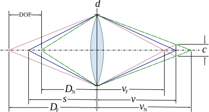

---
head:
  - - link
    - rel: stylesheet
      href: https://cdnjs.cloudflare.com/ajax/libs/KaTeX/0.5.1/katex.min.css
---
# 景深（Depth of Field）

## 什么是景深

首先是来自[维基百科](https://zh.wikipedia.org/zh-cn/%E6%99%AF%E6%B7%B1)的定义：

> 景深（英语：Depth of field, DOF）是指相机对焦点前后相对清晰的成像范围。

中学的时候我们就学过凸透镜成像和相机的原理，可以简单地将相机理解为一个凸透镜成像的应用，相机通过镜头的凸透镜让世界的光线折射到感光的地方。凸透镜成像有一个重要的公式：

$$
\frac{1}{u} + \frac{1}{v} = \frac{1}{f},
$$

其中 $u$ 指的是物距，  $v$ 指的是相距，  $f$ 指的是焦距。通过这个公式我们可以知道，每一个物体的像到镜头的距离是跟物体到镜头的距离有关的，但是光屏或者说感光器到镜头的距离是固定的，这也就意味着，只有特定的距离的物体成像可以落在光屏上。那么其他距离的物体在光屏上会呈现什么呢？答案是**模糊圈**。

我们知道物体成像的位置实际上是物体发出的光线经过透镜汇聚的位置，如果物距偏大，像距小于光屏到透镜的距离，那么光线会在光屏前汇聚，成像也会在光屏前面，光线聚焦后继续往前传播，则会重新发散，到达光屏的时候就会发散成一个圆圈（如果物体是点光源的话）。同样地，当物距偏小的时候，像距回答与光屏到透镜的距离，光线还没来得及汇聚就打到光屏上，也会形成一个圆圈。这样的圆圈就成为模糊圈。

那这是不是意味着我们拍到的照片只有一个距离上的物体是清晰的，其他的都是模糊的呢？很显然不是的，我们平时看到的照片一般不会出现只有一个距离上的物体可以看得清的情况。这是人眼的鉴别能力的缘故，当模糊圈的大小小于人眼能鉴别的最小的物体的时候，我们看到的物体就还是清晰的，这样的模糊圈称为**允许的模糊圈**。反映到物距上，就是当物体在聚焦点前后一定范围内的时候成的像就都是清晰的，这段能成清晰的像的距离就称为**景深**。一般称能成清晰的像的最小物距，也就是最近的物体的距离为**近景深**，而最大的物距，或者说最远的物体的距离为**远景深**，而景深等于这二者的距离。

## 如何计算景深

了解了什么是景深之后，我们自然而然的想要计算景深，具体的是计算近景深和远景深。景深与什么有关呢？在来看[维基百科](https://zh.wikipedia.org/zh-cn/%E6%99%AF%E6%B7%B1):

> 景深通常由物距、镜头焦距，以及镜头的光圈值所决定（相对于焦距的光圈大小）。除了在近距离时，一般来说景深是由物体的放大率以及透镜的光圈值决定。

具体来说，景深与物体的放大率和透镜的光圈的光圈值之间的关系是：
> 固定光圈值时，增加放大率，不论是更靠近拍摄物或是使用长焦距的镜头，都会减少景深的距离；减少放大率时，则会增加景深。如果固定放大率时，增加光圈值（缩小光圈）则会增加景深；减小光圈值（增大光圈）则会减少景深。

如何理解这段话呢？放大率会影响景深是比较好理解的，人眼观看一张在明视距离25厘米的照片，可以分辨出不小于1/4毫米的圆斑，放大倍率越大，1/4毫米的圆斑对应胶片上的大小就越小，从而最大的允许的模糊圈大小就越小，这也就减小了允许偏离聚焦点的距离，从而景深也会越小。同样地，如果放大倍率越小，景深则会越大。

比较难理解的是光圈为什么会影响景深？这里需要说清楚两个概念，光圈值与光圈大小。一般地，光圈的直径 $d$ 等于 $\frac{f}{N}$ ，其中 $N$ 就是光圈值，可以看到，光圈值越大，光圈大小越小，光圈值越小，光圈大小越大。我们固定放大倍率，从而最大的允许的模糊圈的大小也将是固定的，我们要考虑景深，只需要考虑近景深和远景深，也就是考虑恰好在光屏上形成最大的允许的模糊圈的物距。

我们引用[维基百科](https://zh.wikipedia.org/zh-cn/%E6%99%AF%E6%B7%B1)的图：

我们来计算 $D_N$ ，也就是近景深。根据凸透镜成像的公式，可以列出以下式子：

$$
\frac{1}{s} + \frac{1}{v} = \frac{1}{f}
$$
$$
\frac{1}{D_N} + \frac{1}{v_N} = \frac{1}{f}
$$

有根据几何关系，可以得到：

$$
\frac{v_N - v}{v_N} = \frac{c}{d}
$$

从而可以解得：

$$
D_N = \frac{dfs}{df + cs - cf}
$$

可能到了这里大小关系还是不明显，可以简单的变换一下：

$$
D_N = s - \frac{cs(s-f)}{df + cs - cf}
$$

根据凸透镜成像规律，有 $s > f$ ，从而很明显 $d$ 越大， $D_N$ 越大。同样的分析方法，我们可以得到：

$$
D_F = \frac{dfs}{df - cs + cf} = s + \frac{cs(s-f)}{df - cs + cf}
$$

从而 $d$ 越大， $D_F$ 越小。故 $d$ 越大，景深，也就是 $D_F - D_N$越小。也就是说，增大光圈值（减小光圈大小），将增加景深；减小光圈值（增大光圈大小），将减小景深。

最后，我们再引入一个概念，**超焦距**，这是指当远景深被扩大到无穷远时，从焦点到镜头中心的距离。有了上面的公式，我们只需令 $D_F$ 趋近于无穷即可，这会得到

$$
s = \frac{f(c+d)}{c}
$$

这就是超焦距。显然，对同一个透镜，当放大倍率和光圈值固定之后，这也将是一个确定的值。我们可以用它来表示近景深和远景深，我们令

$$
H = \frac{f(c+d)}{c}
$$

当相机聚焦与距离 $s$ 的点时，我们有

$$
D_F = \frac{s(H-f)}{H-s}
$$
$$
D_N = \frac{s(H-f)}{H-2f+s}
$$

特别地，当 $s=H$ 的时候，我们有

$$
D_F = \infty
$$
$$
D_N = \frac{H}{2}
$$

主要参考：

https://zh.wikipedia.org/zh-cn/%E6%99%AF%E6%B7%B1

https://baike.baidu.com/item/%E6%99%AF%E6%B7%B1/82317
