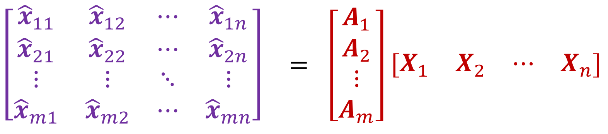
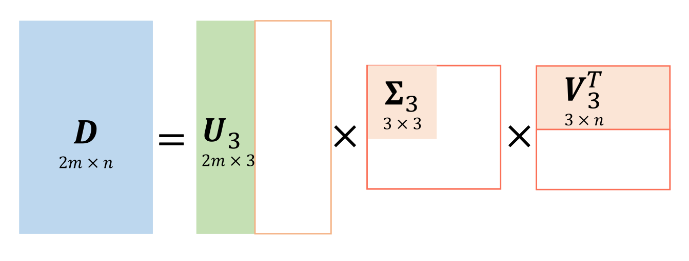

---
head:
  - - link
    - rel: stylesheet
      href: https://cdnjs.cloudflare.com/ajax/libs/KaTeX/0.5.1/katex.min.css
---
# 运动重建结构（Structure from Motion）

我们在[这篇文章](./3d-vision.md)讲了相机标定和三角测量，其中相机标定是从一个相机在不同的地方、不同的角度拍摄的照片上的点对恢复相机的参数，三角测量是从已知参数的相机和照片恢复三维世界的信息，这里我们介绍的 Structure from Motion 则是从一系列不同的相机拍摄的照片及点对中恢复出这些相机的参数和三维信息。

## 基本的问题

假设我们有 $m$ 个相机拍摄的 $m$ 张照片，并知道每张照片上有 $n$ 个点对应的分别的 $n$ 个相同的世界物体，我们要求解得就是这 $m$ 个相机的参数和 $n$ 个世界物体的世界坐标。根据我们对相机成像过程的分析（可以见[这篇文章](./camera-coordinate.md)），我们假设第 $i$ 张照片上的第 $j$ 个点坐标为 $x_{ij}$ ，对应的世界物体的世界坐标为 $X_j$ ，而相机参数矩阵为 $A_i$ ，则有这样的等式成立：

$$
x_{ij} = A_i X_j
$$

而我们已知的就是 $x_{ij}$ ，共有 $mn$ 个坐标，每个坐标有两个维度（除去齐次坐标），事实上我们可以得到 $2mn$ 个方程。而我们要求解的是 $A_i$ 和 $X_j$ ，其中 $A_i$ 是一个 $3\times 4$ 的矩阵，共有 $12m$ 个未知量，而 $X_j$ 有三个维度（除去齐次坐标），共有 $3n$ 个未知量。

## 歧义性问题

不出意料的，我们想仅仅从一系列不同的相机拍摄的照片及点对恢复出相机的参数和三维信息，会有歧义性的问题。

从数学上很容易理解这个问题，如果 $x_{ij} = A_i X_j$ 成立，那么对于任意的 $4\times 4$ 可逆矩阵 $B$ ，都有 $x_{ij} = (A_iB) (B^{-1}X_j)$ ，也就意味着我们得到的解不是唯一的。考虑解的歧义的实际意义，我们有以下的分类

### 仿射歧义

我们添加约束，指定一些线条是平行的，但即使如此，我们的解仍然有歧义性，不过这是 $B$ 不是任意的可逆矩阵，而是满足以下的结构

$$
\left[
  \begin{matrix}
  A & t \\
  0 & 1
  \end{matrix}
\right]
$$

其中 $A$ 是一个 $3\times 3$ 的满秩矩阵，也就是一个仿射投影矩阵，关于仿射变换，可以参考[这篇文章](https://blog.csdn.net/andylei777/article/details/78333817)。

### 相似歧义

指定线条是平行的约束不够强，我们可以再添加要求，指定一些线条是正交的，这事实上就导致了所有线条的角度是不变的，但即使如此，我们的解仍然有歧义性，这时的 $B$ 应该满足以下的结构

$$
\left[
  \begin{matrix}
  sR & t \\
  0 & 1
  \end{matrix}
\right]
$$

其中 $s$ 为非零常数， $R$ 为旋转矩阵。

## 仿射运动重建结构

### 基本问题

考虑当摄像机离物体较远，或者焦距较大的时候，可以用正交投影近似透视投影，从而投影矩阵 $P$ 从

$$
\left[
  \begin{matrix}
  1 & 0 & 0 & 0 \\
  0 & 1 & 0 & 0 \\
  0 & 0 & 1 & 0
  \end{matrix}
\right]
$$

变为了

$$
\left[
  \begin{matrix}
  1 & 0 & 0 & 0 \\
  0 & 1 & 0 & 0 \\
  0 & 0 & 0 & 1
  \end{matrix}
\right]
$$

代回成像公式，我们得到了这样的结果

$$
\left[
  \begin{matrix}
  x \\
  y
  \end{matrix}
\right] = \left[
  \begin{matrix}
  a_{11} & a_{12} & a_{13} \\
  a_{21} & a_{22} & a_{23}
  \end{matrix}
\right] \left[
  \begin{matrix}
  X \\
  Y \\
  Z
  \end{matrix}
\right] + \left[
  \begin{matrix}
  t_1 \\
  t_2
  \end{matrix}
\right]
$$

也即 $x = AX + t$ ，也就是我们的求解问题变为了

$$
x_{ij} = A_i X_j + t_i
$$

或者

$$
\left[
  \begin{matrix}
  x_{ij} \\
  1
  \end{matrix}
\right] = \left[
  \begin{matrix}
  A_i & t_i \\
  0 & 1
  \end{matrix}
\right] \left[
  \begin{matrix}
  X_j \\
  1
  \end{matrix}
\right]
$$

这类似于仿射变换的公式，因而成为仿射运动重建结构。

:::tip
注意这里的 $x$ 和 $X$ **不再是**齐次坐标，要区别于我们在[基本的问题](#基本的问题)中的 $x$ 和 $X$ 。
:::

### 可解性

很显然这个问题的解不是唯一的，具有歧义性，因为 如果

$$
\left[
  \begin{matrix}
  x_{ij} \\
  1
  \end{matrix}
\right] = \left[
  \begin{matrix}
  A_i & t_i \\
  0 & 1
  \end{matrix}
\right] \left[
  \begin{matrix}
  X_j \\
  1
  \end{matrix}
\right]
$$

成立，那么对于任意的仿射矩阵 $Q$ 都有

$$
\left[
  \begin{matrix}
  x_{ij} \\
  1
  \end{matrix}
\right] = (\left[
  \begin{matrix}
  A_i & t_i \\
  0 & 1
  \end{matrix}
\right]Q^{-1}) (Q\left[
  \begin{matrix}
  X_j \\
  1
  \end{matrix}
\right])
$$

成立，因而 $A_iQ^{-1}$ 和 $QX_j$ 也构成问题的一个解。

我们再讨论最少需要多少的点才能求解。注意到每一个 $A$ 有 $6$ 个未知量， $t$ 有 $2$ 个未知量，每个 $X$ 有 $3$ 个未知量，从而总共有 $8m+3n$ 个未知量。总共有 $mn$ 个等式，等式实际上是向量相等，向量有两个维度，从而总共可以列出 $2mn$ 个方程。那么是不是需要 $2mn \ge 8m+3n$ 才能求解呢？不是的，注意到歧义性，即使满足 $2mn \ge 8m+3n$ 我们也不可能求出唯一解，我们事实上需要求得的是一个解集，我们要讨论的也是我们要求解出这样的解集需要多少点。这个分析起来比较困难，类比线性方程组的理论，我们需要的线性无关的方程数目等于未知量的数目减去解空间的自由度，这里我们类推出（并不严谨）我们需要的方程数是未知量的数目减去解的自由度。解的自由度来自于矩阵 $Q$ ，这是一个 $4\times 4$ 的仿射矩阵矩阵，因而自由度为 $12$ ，从而我们事实上只需要满足 $2mn \ge 8m+3n-12$ 。对于两个相机的情况，也即 $m=2$ 的情况，我们需要的最少点数为 $4$ 。

### 中心化

注意式子的实际意义， $t_i$ 实际上表示的是坐标的平移变换，而这可以通过坐标系的平移以消除，令 $\hat{x_{ij}} = x_{ij} - \frac{1}{n}\sum\limits_{k=1}^{n}x_{ik}, \hat{X_{j}} = X_{j} - \frac{1}{n}\sum\limits_{k=1}^{n}X_{k}$ ，很容易发现

$$
\hat{x_{ij}} = A_i \hat{X_j}
$$

为了简便起见，我们将世界坐标系的原点建立在 $X_j$ 的中心，于是变为了

$$
\hat{x_{ij}} = A_i X_j
$$

### 具体求解

将方程组排列成矩阵，如下所示（图片取自课件）

:::tip
需要注意 $\hat{x_{ij}}$ 和 $X_j$ 都是向量，所以上面实际上是一个 $2m\times n$ 矩阵、 $2m\times 3$ 矩阵和 $3\times n$ 矩阵。
:::

将上面的方程记为 $D = MS$ 这事实上就是一个矩阵分解问题。

注意到 $M$ 和 $S$ 的秩最多都为 $3$ ，故 $D$ 的秩最多为 $3$ ，由于随机性，它们的秩大部分时候都应该是 $3$ ，故我们可以进行 $SVD$ 分解，从而进行低秩逼近，具体的如图所示（图片取自课件）

一个简单的解就是 $M = U_3 \Sigma_3^{\frac{1}{2}}, S = \Sigma_3^{\frac{1}{2}}V_3$ 。

### 消除歧义性

我们增加一个约束，要求 $A_i$ 的两个行向量为正交单位向量，这事实上是一个保角约束。假设我们从上面的简单解得到的解为 $A_i$ ，现在我们需要找到 $Q$ ，使得 $A_iQ(A_iQ)^T = I$ ，也即 $A_i(QQ^T)A_i^T = I$ 。这不是一个线性问题，无法使用最小二乘法，我们稍作调整，令 $L=QQ^T$ ，则问题变为求解 $A_iLA_i^T=I$ ，这就是一个线性问题了，可以通过最小二乘法求解 $L$ ，然后应用 Cholesky 分解即可求解 $Q$ ，而后替换 $A_i = A_iQ, X = Q^{-1}X$ 。

## 投影运动重建结构

### 基本问题

对于普通的情形，我们的式子还是回到的这个式子

$$
x_{ij} = A_i X_j
$$

需要注意的是这里用的是齐次坐标，等于号表示的也只是齐次坐标表示的相等，也就是会有常数比例的差异。

### 可解性

显然这个问题也是具有歧义性的，无法得到唯一解，因为如果

$$
x_{ij} = A_i X_j
$$

成立，那么对于任意的可逆矩阵 $Q$ ，都有

$$
x_{ij} = A_iQ^{-1} QX_j
$$

也成立，因而 $A_iQ^{-1}$ 和 $QX_j$ 也构成问题的解。

很容易分析到未知量的数目为 $12m+3n$ ，而方程数目为 $2mn$ ，同时注意到由于齐次坐标相等的定义，每一个 $A_i$ 有 $1$ 个自由度，以及注意到上面的歧义性， $Q$ 是一个 $4\times 4$ 的可逆矩阵，我们另有 $15$ 个自由度，故总共有 $m+15$ 自由度，故求解这个问题需要满足 $2mn \ge 11m+3n-15$ 。对于两个相机的情况，也就是 $m=2$ 的情况，我们需要至少 $7$ 个点。

### 具体求解

你可以仿照上面仿射运动重建结构的方法求解，但这里介绍对于两个相机的情况的一种求解方法。我们通过调整世界坐标系，使得第一个相机的参数矩阵为 $\left[
  \begin{matrix}
  I & 0
  \end{matrix}
\right]$ ，设此时第二个相机的参数矩阵为 $\left[
  \begin{matrix}
  A & t
  \end{matrix}
  \right]$ ，从而我们只需要求解 $A$ 和 $t$ ，很容易知道 $F^Tt=0$ 和 $A=-[t_{\times}]F$ （具体的推导可以参考[上一篇文章](./3d-vision.md)，但我还没有完成这部分的内容）。
